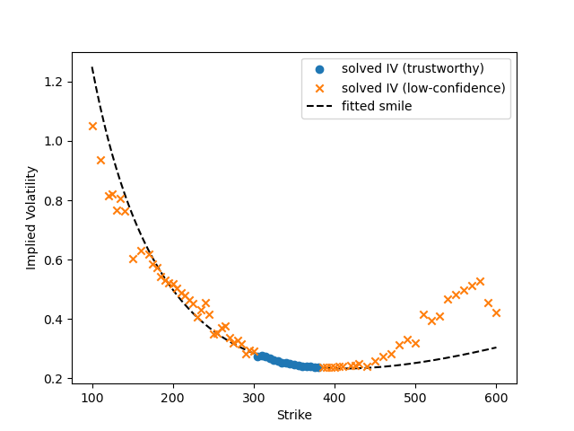

# Option_Pricer

An end-to-end options analytics pipeline: fetches live option chains, flags
data-quality issues using real market conventions, prices contracts via
Black-Scholes, solves implied volatility with a confidence check, fits a
volatility smile, cross-validates calls against puts, and reports/visualizes
results, all from one CLI command.

## What it does

Given a ticker, the pipeline:

1. Fetches the live option chain, spot price, and risk-free rate (yfinance)
2. Infers the chain's true spot price from put-call parity, correcting for
   non-simultaneous quotes between the chain and the spot feed
3. Flags (not drops) data-quality issues: no-arbitrage violations, strike
   monotonicity/convexity breaks, wide spreads, stale or illiquid quotes,
   invalid/duplicate strikes
4. Solves implied volatility per contract, flagging results that fall in a
   mathematically unreliable region (deep ITM/OTM)
5. Prices each contract against realized volatility for comparison
6. Fits a volatility smile to the clean, trustworthy points
7. Cross-checks calls against puts via put-call parity
8. Reports a summary and (optionally) saves charts and full data tables

## Data and methodology

The pricing formulas themselves are standard. This section documents the
data-quality handling built around them, and the observations from live chains
that motivated each choice.

**Non-simultaneous quotes.** The chain and the spot price are retrieved from
different endpoints, so on a moving day the chain is priced against a spot that
has already drifted. Measured across SPY, QQQ and AAPL the gap ran $0.52-$0.94,
with residuals 100% one-sided and dispersion roughly 6x smaller than the offset,
indicating a level shift rather than noise and one no bid/ask tolerance can
absorb. Uncorrected, this biased every solved implied volatility by 0.5-0.9 vol
points. `implied_spot` inverts put-call parity across the chain to recover the
spot the options are quoted against; spurious arbitrage flags on SPY fell from
78% to 19%, with residual dispersion unchanged.

**Executable no-arbitrage screens.** Because `mid ± half-spread` is algebraically
`bid`/`ask`, each screen reduces exactly to a trade that clears at quoted prices:

| screen | reduces to |
|---|---|
| no-arbitrage lower | `ask < S - Ke^(-rT)` (buy below the floor) |
| no-arbitrage upper | `bid > S` (sell above the ceiling) |
| strike monotonicity | `bid(K2) > ask(K1)` (vertical spread for a credit) |
| strike convexity | `bid(K2) > w·ask(K1) + (1-w)·ask(K3)` (butterfly for a credit) |
| put-call parity | `bid(C) - ask(P) > S - Ke^(-rT)` (conversion/reversal) |

The tolerance is therefore derived rather than chosen. This framing also
identified an error in the convexity screen, which distance-weighted the prices
but not the tolerances, leaving it roughly 2x too lenient and admitting
butterflies worth up to $23/contract. Tested against 3,000 randomized strike
triplets, the corrected form agrees with the executable condition in every case;
the previous form agreed in 98.1%, with every disagreement a false negative.

**Threshold sourcing.** Spread quality follows CBOE's tick rules (pennies below
$3, nickels at or above), so a $0.01x$0.02 contract is treated as tick-bound
rather than as a 67% spread. The implied volatility confidence threshold follows
Duarte, Jones & Wang (2024, *Journal of Finance*). Realized volatility is computed
from price history rather than from an option's own price, so the comparison of
market against theoretical prices is not circular.

**Feed representations.** `contractSize` is reported as the string `"REGULAR"`
rather than as a share count, so comparison against `100` flagged every contract
in every chain. `bid` and `ask` may be `NaN` rather than `0`, which caused rows
with no price to be treated as priceable and produced a `NaN` tolerance,
disabling violation checks on both that row and its neighbour.

**Implied volatility solver.** Newton-Raphson with a bisection fallback on
convergence failure. Converged results are separately flagged where vega is
small, since many volatilities then reproduce nearly the same price.

## Installation

```bash
git clone <repo-url>
cd Option_Pricer
pip install -r requirements.txt
```

## Usage

```bash
python main.py AAPL
python main.py TSLA --expiration 2026-11-20 --period 3mo
python main.py AAPL --save output/ --plot charts/
python main.py --help
```

| Flag | Description |
|---|---|
| `--expiration` | Expiration date (YYYY-MM-DD); defaults to nearest |
| `--exchange` | Trading calendar to use (default: NYSE) |
| `--period` | Lookback period for realized volatility (default: 1y) |
| `--quoted-spot` | Use yfinance's quoted spot as-is instead of the parity-inferred one |
| `--save DIR` | Save full cleaned calls/puts/parity tables as CSV |
| `--plot DIR` | Save smile and price-comparison charts as PNGs |

## Example output

```
AAPL -- spot=$338.83  expiration=2026-11-20  T=0.1753yr  risk-free rate=4.06%  realized vol(1y)=24.69%
  spot quoted $338.98, implied by parity $338.83 (-0.15) -- non-simultaneous quotes, plus PV(dividends) for any ex-date before expiration

--- Calls (83 contracts) ---
  no-arbitrage violations: 3.6%
  illiquid: 47.0%
  IV solved: 94.0% (78/83)
  low-confidence among solved: 79.5%
  median implied vol: 0.3428

--- Puts (61 contracts) ---
  no-arbitrage violations: 0.0%
  illiquid: 44.3%
  IV solved: 100.0% (61/61)
  low-confidence among solved: 72.1%
  median implied vol: 0.3888

--- Put-Call Parity (58 matched strikes checked) ---
  violations: 1.7%
  residual spread: median -0.000, std 0.431

Calls smile fit (from 16 clean points): a=0.2524 b=-0.1996 c=0.5062
Puts smile fit (from 17 clean points): a=0.2518 b=-0.1304 c=1.5037
```

After the spot correction the residual *median* is ~0 by construction, so the *std*
is the number worth reading.

With `--plot`, the same run also produces the fitted smile:



The colour split is the confidence flag. Trustworthy points (blue) cluster near the
money; low-confidence points (orange) fan into the wings, where vega collapses. The
curve is fitted to the blue points only, then extrapolated across all strikes.

## Project structure

```
src/data/fetch_options.py       # live data ingestion (yfinance)
src/data/cleaning_options.py    # data-quality flagging pipeline
src/pricing/black_scholes.py    # pricing formulas & Greeks
src/pricing/implied_vol.py      # IV solver + confidence flagging
src/pricing/smile.py            # volatility smile fitting
src/visualization.py            # chart generation
main.py                         # CLI entry point
tests/                          # 215 tests
```

**Flag, don't drop**: nothing is silently removed. Every check writes a boolean
column and leaves the caller to decide, so a contract can fail one screen and remain
usable for another. **Time-to-expiry is measured in trading sessions**, not calendar
days, via `pandas_market_calendars`, including partial credit for the current session
and real early closes (the day after Thanksgiving is 09:30-13:00, not 09:30-16:00).

## Running tests

```bash
pytest -q          # 215 passed
```

Correctness is checked against independent references rather than against the code
itself: Greeks by finite difference, textbook identities (put-call parity,
`Δcall - Δput = 1`), known-sigma round trips, and a 3,000-case randomized equivalence
check on the arbitrage screens. Coverage is 99% across `src/` and `main.py`.

## Known limitations

- No dividend yield (`q=0`) in the pricing model
- European-style pricing assumption vs. real American-style equity options
- `implied_spot` returns `S - PV(D)` on a dividend payer, not the traded share price.
  That is the right input for a `q=0` model (the escrowed-dividend adjustment), but the
  number sits below the share price and the reported gap includes `PV(D)`
- American early exercise turns the parity equality into an inequality band, so
  `implied_spot` reads slightly low, most so at deep ITM strikes. The median mitigates
  this, since early-exercise premium concentrates in the wings
- Uniform chain-wide parity violations are absorbed into the inferred spot rather than
  flagged, since a stale spot and a genuine chain-wide mispricing are indistinguishable
  from inside the chain. `--quoted-spot` gives the uncorrected view
- Single-expiration scope, with no multi-expiration term structure or full vol
  surface yet
- The confidence flag is delta-only, so it doesn't catch the separate ATM-near-expiry
  low-vega case
- `historical_volatility` is a single flat number and can't capture smile/skew on its
  own; that's what the fitted smile is for
