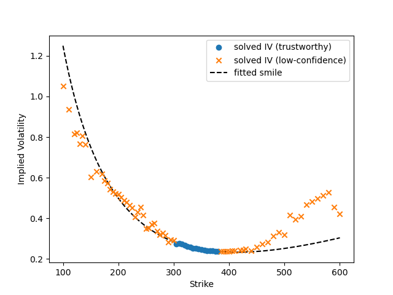

# Option_Chain_Pipeline

An options analytics pipeline: fetches live option chains, flags data-quality issues, prices contracts using Black-Scholes, solves implied volatility with a confidence check, fits a volatility smile and cross-validates calls against puts.

Also offers visualizations and reports for results. Only needs one CLI command to operate.

## Spot Correction

It was discovered that the spot and chain came from different endpoints and are not sampled together. This showed up in data as the bulk of the parity residuals having the same sign. Other causes were ruled out (dividends and interest rates) as the gap did not grow from 1 to 30 day expirations as expected with these two cases. To solve this issue an implied_spot calculation was implemented.

implied_spot inverts put-call parity (S = C - P + K·e^(-rT)) at each clean matched strike and takes the median. The result replaces the quoted spot everywhere downstream. `--quoted-spot` disables this.

## Example output

```
AAPL -- spot=$338.83  expiration=2026-11-20  T=0.1753yr  risk-free rate=4.06%  realized vol(1y)=24.69%
  spot quoted $338.98, implied by parity $338.83 (-0.15) -- non-simultaneous quotes, plus PV(dividends) for any ex-date before expiration

--- Calls (83 contracts) ---
  no-arbitrage violations: 3.6%
  illiquid: 47.0%
  IV solved: 94.0% (78/83)
  low-confidence among solved: 79.5%
  median implied vol: 0.3428

--- Puts (61 contracts) ---
  no-arbitrage violations: 0.0%
  illiquid: 44.3%
  IV solved: 100.0% (61/61)
  low-confidence among solved: 72.1%
  median implied vol: 0.3888

--- Put-Call Parity (58 matched strikes checked) ---
  violations: 1.7%
  residual spread: median -0.000, std 0.431

Calls smile fit (from 16 clean points): a=0.2524 b=-0.1996 c=0.5062
Puts smile fit (from 17 clean points): a=0.2518 b=-0.1304 c=1.5037
```

One thing to note about the results is that the residual median is ~0 by design, since the spot is set from the median. Thus, the important result is the standard deviation.

With `--plot`, the same run also produces the fitted smile:



Trustworthy points are marked in blue. The orange points are low-confidence and located in the wings of the graph where vega collapses. The curve is fitted to the blue points and extrapolated for the wings.

## Couple important notes

The pipeline only flags and does not drop data. This means none of the data is removed by the cleaning functions. Instead each check writes a boolean column. This allows the user to decide which flags to drop from the data and which to keep.

The IV is solved using Newton-Raphson. If this fails it falls back to Brent's method. Using the logic established by Duarte, Jones and Wang (2024 JF), a solved IV is flagged low-confidence when |Δ| < 0.15 or |Δ| > 0.85, since the vega there is too small to pin down σ. The smile, IV = a + b·k + c·k² with k = ln(K/S), is fitted by least squares to high-confidence IVs only.

The tests check results against known values and independent methods: Greeks by finite difference, textbook identities (put-call parity, Δcall - Δput = 1), and known-sigma round trips.

## Known limitations

- No dividend yield (q=0) in the pricing model
- European-style pricing assumption vs. real American-style equity options
- Single-expiration scope, with no multi-expiration term structure or full vol surface yet
- Near-expiry ATM options also have low vega, and the delta-only flag misses them

## Claude Usage

Claude built the CLI and the visualization code entirely. I found these helpful for running the pipeline and seeing the results, as my main focus for the project was the methodology rather than the software design itself. Claude also designed the tests for the model. This was done to help catch errors in code. My next step for the project is to run through and build some of my own tests. Claude also helped clean up syntax and fix bugs in code throughout the project.

## Installation

```
git clone https://github.com/wilsonschaefer2025-a11y/Option_Chain_Pipeline.git
cd Option_Chain_Pipeline
pip install -r requirements.txt
```

## Usage

```
python main.py AAPL
python main.py TSLA --expiration 2026-11-20 --period 3mo
python main.py AAPL --save output/ --plot charts/
python main.py --help
pytest -q
```
